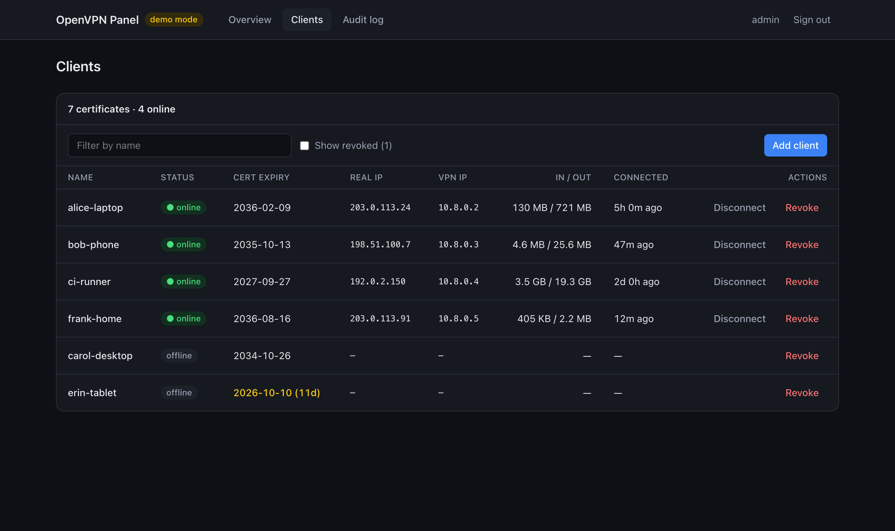

# openvpn-panel

[](https://github.com/BugsBountyHunter/openvpn-panel/actions/workflows/ci.yml)
[](LICENSE)

A small, self-hosted web dashboard for OpenVPN servers installed with
[angristan/openvpn-install](https://github.com/angristan/openvpn-install).

See who is connected, add clients (the `.ovpn` downloads straight to your
browser and is never stored), revoke or disconnect them, and keep an audit
trail — without handing a web app root access.



## Quick install

On an Ubuntu/Debian server where OpenVPN was installed with
[openvpn-install.sh](https://github.com/angristan/openvpn-install):

```bash
curl -fsSLO https://github.com/BugsBountyHunter/openvpn-panel/releases/latest/download/install.sh
sudo bash install.sh --bind 10.8.0.1
```

- `--bind` is the address the panel listens on. Use your server's **VPN IP**
  (usually `10.8.0.1`, see `ip addr show tun0`) so only VPN users can reach it,
  or leave it out for `127.0.0.1` and use an SSH tunnel.
- You'll be asked to **choose the panel admin password**. Only its hash is
  stored.
- The installer downloads the latest release, **verifies its SHA-256
  checksum**, sets everything up and starts the panel.

Then connect to your VPN and open **http://10.8.0.1:8081**, user `admin`.

If `ufw` is active, allow the panel on the VPN interface only:

```bash
sudo ufw allow in on tun0 to 10.8.0.1 port 8081 proto tcp
```

### Requirements

- Linux with systemd; `sudo`, `socat`, `curl` (`apt install sudo socat curl`).
- OpenVPN installed with a recent
  [openvpn-install.sh](https://github.com/angristan/openvpn-install) (it must
  have the `client` CLI and `OUTPUT_FORMAT=json`). The installer looks for it in
  the current directory, `/root` and your home directory, or pass
  `--installer /path/to/openvpn-install.sh`.
- **Node.js ≥ 24.7** in a system path (`/usr/bin/node` or
  `/usr/local/bin/node`). If you use `nvm`, copy its binary once. The service
  cannot see your home directory, and the installer prints this command for you:

  ```bash
  sudo install -m 0755 "$(command -v node)" /usr/local/bin/node
  ```

Tested on Ubuntu 24.04 with OpenVPN 2.7.7, plus recorded output from OpenVPN
2.5 and 2.6.

### Verify the download (optional)

Releases are built by GitHub Actions with signed build provenance:

```bash
gh attestation verify install.sh -R BugsBountyHunter/openvpn-panel
```

### Update

```bash
sudo openvpn-panel-update            # latest release
sudo openvpn-panel-update v0.2.0     # or a specific one
```

Your settings and password are kept. The new version is health-checked and the
previous one is restored automatically if it fails. Re-running `install.sh`
with different options (e.g. `--port 9000`, `--reset-password`) changes
settings the same way.

### Uninstall

```bash
sudo openvpn-panel-uninstall           # keeps /etc/openvpn-panel and the audit log
sudo openvpn-panel-uninstall --purge   # removes them too
```

OpenVPN and your clients are not affected.

### Installer options

| Option | Default | |
| --- | --- | --- |
| `--bind IP` | `127.0.0.1` | listen address; the VPN IP for VPN-only access. `0.0.0.0` is refused. |
| `--port PORT` | `8081` | |
| `--admin-user NAME` | `admin` | |
| `--reset-password` | | ask for a new admin password |
| `--version TAG` | `latest` | install a specific release |
| `--installer PATH` | auto | path to your `openvpn-install.sh` |
| `--mgmt-bridge unix\|tcp` | `unix` | how the panel reaches OpenVPN's management socket (see SECURITY.md) |

Non-interactive installs: set `PANEL_ADMIN_PASSWORD` in the environment.

### What gets installed

| Path | Purpose |
| --- | --- |
| `/opt/openvpn-panel/releases/*`, `current` | app releases (last 3 kept) |
| `/etc/openvpn-panel/env` | configuration, `0600 root` |
| `/var/lib/openvpn-panel/audit.log` | audit log |
| `/usr/local/sbin/openvpn-panel-helper` | the only command the panel may `sudo` |
| `/usr/local/sbin/openvpn-panel-update`, `-uninstall`, `-deploy` | maintenance commands |
| `/usr/local/sbin/openvpn-install.sh` | root-only copy of your installer |
| `/etc/sudoers.d/openvpn-panel` | sudo rule for the helper |
| `openvpn-panel.service`, `openvpn-panel-mgmt.service` | the panel and its management-socket bridge |

## Try it without a server (demo mode)

```bash
git clone https://github.com/BugsBountyHunter/openvpn-panel.git && cd openvpn-panel
npm ci && npm run dev
```

Open http://127.0.0.1:8081 and sign in as `admin` / `demo`. The data is fake.

## Features

- **Overview** — OpenVPN up/down, uptime, connected clients, total traffic,
  certificates expiring soon.
- **Clients** — name, active/revoked, certificate expiry, online now, real IP,
  VPN IP, bytes in/out, connected since. Add (profile download), Revoke (with
  confirmation) and Disconnect. The server's own `server_*` certificate is
  hidden and cannot be touched.
- **Audit log** — who did what, when and from where: sign-in, add, revoke,
  disconnect (append-only JSON lines).
- **Single admin** login with an argon2id or bcrypt hash, rate limiting and
  CSRF protection.
- **Demo mode** with fake data for local development, screenshots and tests.
- `GET /api/health` for deploy checks.

## How it works

```
browser ──HTTP(S) over VPN──▶ Next.js panel (user: openvpn-panel, sandboxed)
                                   │                    │
               status / kill       │                    │  sudo -n (only this program)
                                   ▼                    ▼
       socat bridge ─▶ OpenVPN management socket   /usr/local/sbin/openvpn-panel-helper
       (0600 unix socket or 127.0.0.1:7505)             │  add | revoke | list | status
                                                        ▼
                                           openvpn-install.sh client … (root)
```

- Live data comes from the OpenVPN **management interface** (`status 3`,
  `load-stats`, `state`, `kill`). It serves one client at a time, so the
  panel connects per request, serializes access and uses short timeouts.
- Certificate operations go through a tiny root-owned **helper** that accepts
  a fixed set of verbs and a name matching `^[A-Za-z0-9_-]{1,32}$`. The panel
  never runs `openvpn-install.sh` itself, and never uses a shell.
- **Renew** re-issues a client certificate (`openvpn-install.sh client renew`,
  optional validity in days) and downloads the new profile once. The old
  certificate is revoked, so the old profile stops working.
- The overview warns 30 days before the server certificate, the CA or the CRL
  expires (read-only `pki` helper verb, cached for 10 minutes). An expired CRL
  makes OpenVPN reject every client, so treat that warning as urgent.
- Data sources sit behind a `Backend` interface (`src/lib/types.ts`), so other
  installers can be supported by adding a backend.

## Security model

- Releases are checksum-verified by the installer and carry GitHub build
  provenance.
- Binds to `127.0.0.1` by default. Use the server's VPN IP (e.g. `10.8.0.1`)
  to reach it over the VPN only; never expose it publicly.
- The panel runs as an unprivileged system user in a hardened systemd unit.
  Its only privilege is `sudo` for the helper (validated with `visudo -c`).
- Profiles are streamed to the browser and deleted from disk immediately; they
  are never logged or stored by the panel.
- Sessions: HMAC-signed, `httpOnly`, `SameSite=Strict` cookie (12 h).
  Mutations require POST + matching `Origin` + JSON bodies.
- Login attempts are rate-limited per IP and globally.
- No secrets or server addresses live in the repository — everything is
  configured through environment variables.

Details and known trade-offs: [SECURITY.md](SECURITY.md).

## Deployment options

The panel runs natively under systemd next to OpenVPN. That is deliberate:

| Approach | Verdict |
| --- | --- |
| **Native systemd service** (this project) | ✅ Unprivileged user, read-only sandbox, `sudo` limited to one small helper. Matches a native openvpn-install server. |
| Panel in Docker + host helper over a socket | Possible, but adds a root daemon for the container to call — more moving parts for the same result. |
| Docker with `--privileged` / `/etc/openvpn` mounted | ❌ Equivalent to root on the host; defeats the privilege separation. |
| OpenVPN and panel both in containers | Only sensible for new servers; migrating means reissuing every client profile. |

Demo mode has no privileged parts, so it is fine to run anywhere, including a
container.

## Configuration

The installer writes these for you. All settings are environment variables, validated at startup
(see [.env.example](.env.example)):

| Variable | Default | Notes |
| --- | --- | --- |
| `PANEL_MODE` | `demo` | `live` for a real server |
| `PANEL_HOST` | `127.0.0.1` | bind address |
| `PANEL_PORT` | `8081` | |
| `OVPN_MGMT` | `tcp:127.0.0.1:7505` | or `unix:/path/to.sock` (the installer uses a unix socket) |
| `PANEL_HELPER` | `/usr/local/sbin/openvpn-panel-helper` | |
| `ADMIN_USER` | `admin` | |
| `ADMIN_PASSWORD_HASH` | — | required in live mode; `npm run hash-password` |
| `SESSION_SECRET` | — | ≥ 32 chars, required in live mode |
| `AUDIT_LOG_PATH` | `./data/audit.log` | |

## For maintainers

### Publishing a release

1. Bump `version` in `package.json`, update `CHANGELOG.md`, merge to `main`.
2. Tag and push: `git tag v0.2.0 && git push origin v0.2.0`.

`release.yml` checks that the tag matches `package.json`, runs all checks,
builds the bundle (`openvpn-panel.tar.gz`: app + server scripts + `VERSION`),
writes `SHA256SUMS`, attests build provenance and publishes the GitHub release.
Every `openvpn-panel-update` picks it up.

### Continuous deployment to your own server (optional)

`deploy.yml` deploys every push to `main` to one server over SSH. It uses the
same health check and rollback. Most users don't need this; it's for running
the development version.

1. Create a key pair: `ssh-keygen -t ed25519 -f deploy_key -N ""`.
2. On the server: `sudo openvpn-panel-update --deploy-key "$(cat deploy_key.pub)"`.
   The key can do nothing but run the deploy script.
3. Add repository secrets `DEPLOY_HOST`, `DEPLOY_SSH_KEY` (the private key) and
   `DEPLOY_KNOWN_HOSTS` (`ssh-keyscan -t ed25519 <host>`, fingerprint verified
   out of band); optional variable `DEPLOY_SSH_PORT`.

Without these secrets (e.g. in forks) the deploy job is skipped. Deploys run in
a `production` environment where you can require approvals.

### Installing a local build

```bash
npm ci && npm run build && scripts/package-release.sh
scp release.tar.gz you@server:
# on the server:
mkdir -p panel-build && tar -xzf release.tar.gz -C panel-build
sudo bash panel-build/server/install.sh --app release.tar.gz
```

## Development

```bash
npm run dev            # demo mode on 127.0.0.1:8081 (admin / demo)
npm test               # unit + integration tests (vitest)
npm run test:coverage  # same, enforcing coverage thresholds
npm run build          # standalone output in .next/standalone
npm run test:e2e       # Playwright against the production build (run build first)
npm run lint
npm run typecheck
```

### Testing strategy

| Layer | What it covers |
| --- | --- |
| Unit | parsers (recorded `status 3` from OpenVPN 2.5/2.6/2.7), management client against a fake server, sessions, password hashing, rate limiting, audit log, helper runner |
| Integration | every API route and the proxy: login, CSRF, add → disconnect → revoke lifecycle, audit entries, `server_*` protection |
| E2E | Playwright on the production build: login, add/download, confirmations, audit page, sign-out, security headers, no horizontal scroll on mobile |
| Install / update | the real one-command install, tampered-download refusal, update keeping settings, and uninstall, in a clean Debian container against a fake release server |
| Server scripts | ShellCheck |

CI runs all of the above on every push and pull request; line coverage must
stay above 80 %.

See [CONTRIBUTING.md](CONTRIBUTING.md).

## License

[MIT](LICENSE)
